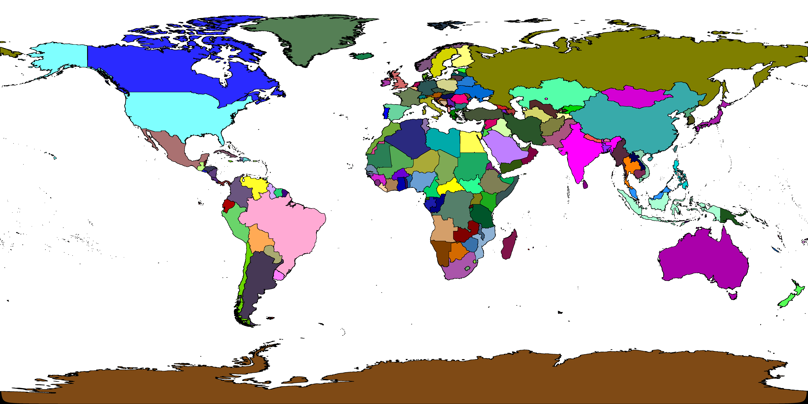

Map Image Lookup
================

The classes in `org.gbif.geocode.ws.layers` each refer to a PNG bitmap rendering of their layer, with each region having
a unique colour, and off-layer areas being white.  Borders and some other areas are black, and are still looked up using
the database.  This allows for over 90% of queries to avoid querying the database.  Queries to these areas are almost
instant, for some layers off-layer queries (e.g. international water) can be particularly slow using the database.

The class `MyBatisGeocoder` refers to a combined PNG bitmap of all the default layers, and works in the same way.

## Process to generate the map image

All the bitmaps are generated by [BitmapGenerator](src/main/java/org/gbif/geocode/ws/util/BitmapGenerator.java).

It uses PostGIS's ability to export SVG shapes/paths, plus a very simple SVG template, and a method to generate unique
colours for each area.  The Batik library is used to render the PNG.  The intuitive option of setting
`shape-rendering="crispEdges"` to disable anti-aliasing is, unfortunately, not appropriate.  This leads to tiny
areas and tiny holes being omitted from the bitmap:

(The yellow line is the true path from the database, tiny island "holes" in the Australian EEZ are not marked in the
bitmap.)

Instead, we use an image rendered with `shape-rendering="geometricPrecision"`:

and set any non-white pixel in this image to black in the coloured image:

Generating the SVGs and converting them to bitmaps is slow, so the results are committed to the repository.
