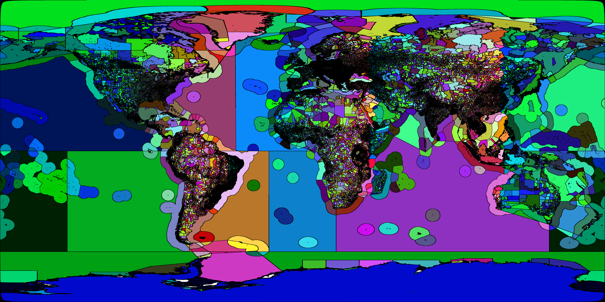

# Geocode WS

RESTful service that provides the reverse geocode functionality. The REST resource should be accessible at this URL: `http://{server}:{httpPort}/reverse`.

The GBIF instance is available at `https://api.gbif.org/v1/geocode/reverse`.

## How to build and run this project

Shapefiles and the database URL and credentials are required to start the application. You can provide them in different ways.

### Using maven
You can put the DB credentials in a maven profile:

```xml
<profile>
  <id>geocode-ws</id>
  <properties>
    <geocode-ws.url></geocode-ws.url>
    <geocode-ws.username></geocode-ws.username>
    <geocode-ws.password></geocode-ws.password>
  </properties>
</profile>
```

Then start the application with maven and your profile: `mvn -Pgeocode-ws spring-boot:run`

### Using a Java command

You can create an [application.yml](src/resources/application.yml) and a [bootstrap.yml](src/resources/bootstrap.yml) files
and pass them to the application:

`java -jar geocode-ws-{your-version}-exec.jar.jar --spring.config.location=your_path/application.yml --spring.cloud.bootstrap.location=your_path/bootstrap.yml`

If you want to run the application with a java command this is the only way to pass the properties since the [application.yml](src/resources/application.yml) and a [bootstrap.yml](src/resources/bootstrap.yml)
files provided in the project are not included in the packaged jar.

### Using your IDE
For development, it might be easier to run the [GeocodeWsApplication](src/main/java/org/gbif/geocode/ws/GeocodeWsApplication.java) class
from your IDE and choose the right maven profile or override the properties in the [application.yml](src/resources/application.yml) file provided in the project.

## Testing

First, run the project in one of the ways mentioned above.

Then go to: http://localhost:8080/geocode/reverse?lat=55.68&lng=12.00

Response should be:

```json
[
    {
        "id": "EUROPE",
        "type": "Continent",
        "source": "https://github.com/gbif/continents",
        "title": "EUROPE",
        "isoCountryCode2Digit": "",
        "distance": 0.0,
        "distanceMeters": 0.0
    },
    {
        "id": "http://marineregions.org/mrgid/5674",
        "type": "Political",
        "source": "https://www.marineregions.org/",
        "title": "Denmark",
        "isoCountryCode2Digit": "DK",
        "distance": 0.0,
        "distanceMeters": 0.0
    },
    …
```

You can also try http://localhost:8080/geocode/debug/map.html

## Create the database and shapefiles

See [../database/scripts/import.sh](../database/scripts/import.sh) for a script to import the database, and from it export shapefiles. With appropriate environment variables, it can be used against non-Docker databases.

## Map image for faster lookups

There is a PNG image used to speed up queries — after an initial query, roughly 95% of the world's area can be determined without referring to the database at all.



See [Map Image Lookup](./MapImageLookup.adoc) for how the image is created.

The layers GADM0, GADM1 and GADM2 are queried at the same time as GADM3.  Since GBIF usage is for GADM3, efficient caching of the lower layers isn't implemented
